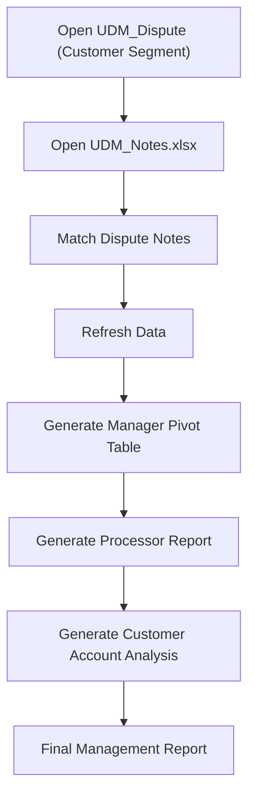

# Customer Dispute Board-Report Automation

## 📋 Project Overview
This VBA automation generates customer segment-specific dispute management reports by consolidating dispute data, merging analyst notes, and producing interactive summary reports for operational review.

The macro automatically opens today's UDM_Dispute workbook for a selected customer segment, enriches the data using information from UDM_Notes, and generates Pivot Tables that summarize open disputes by manager, disputed value, and customer account.

In addition, the automation prepares processor-specific worksheets with employee IDs to streamline report distribution and email communication. By eliminating repetitive report preparation, the solution significantly reduces manual effort while ensuring consistent and accurate reporting across customer segments.

## 📂 Data Sources
The automation processes two Excel workbooks:

    UDM_Dispute.xlsm (per region)
    - This the primary dispute database containing customer and invoice information. The most relevant columns are:
        - AOR "Customer Region"
        - Days 
        - Case ID "Dispute Number"
        - External Reference "Purchase Order"
        - Sales Order
        - Case Title "Invoice Number"
        - Inv Date
        - Customer Number
        - Customer Name
        - Cause Desc
        - Disputed Amount
        - Processor Name "Dispute Responsible"

    UDM_Notes.xlsx
    - this secondary database contains additional dispute notes and related info, just the dispute notes are relevant to be matched against the master dataset, using a unique identifier "Dispute Number (Case ID)"

## ⚙️ Automation Workflow
 The VBA automation performs the complete reporting workflow automatically.
1. Load Customer Segment Report
    - The macro opens the latest UDM_Dispute workbook for the selected customer segment.
    - Example input files:
        - UDM_Dispute 07-01-2026_Africa.xlsm
        - UDM_Dispute 07-01-2026_Europe.xlsm
        - UDM_Dispute 07-01-2026_LATAM.xlsm

    - Each workbook contains information such as:
        - Customer Account
        - Customer Segment
        - Region
        - Invoice Number
        - Dispute Number
        - Disputed Amount
        - Invoice Date
        - Dispute Creation Date
        - Purchase Order
        - Sales Order
        - Dispute Owner

2. Merge Dispute Notes
    - The automation opens the UDM_Notes workbook.
    - Using the unique Dispute Number, it matches every dispute with its corresponding analyst notes and appends the information to the dispute report.
    - This ensures managers always review the latest customer comments and dispute updates.

3. Generate Manager Summary
    - Using Pivot Tables, the macro summarizes dispute activity by manager.
    - The report includes:
        - Total open disputes
        - Total disputed amount
        - Manager workload distribution
    - These summaries provide operational leaders with an immediate overview of dispute ownership across the organization.

4. Prepare Processor Report
    - The automation generates a worksheet containing:
        - Processor name
        - Employee ID
    - This worksheet is designed to support downstream email distribution and reporting activities.

5. Generate Account Analysis
    - The macro refreshes an additional Pivot Table that allows users to analyze disputes by:
        - Customer Account
        - Number of Open Disputes
        - Total Disputed Amount per Customer
        - Managers can quickly filter and prioritize high-value or high-volume customer accounts.

## 📈 Key Insights
- Automatically opens customer segment dispute reports
- Merges analyst notes into dispute records
- Matches records using unique dispute identifiers
- Generates Pivot Tables automatically
- Summarizes open disputes by manager
- Calculates disputed value by owner
- Creates processor reporting worksheets
- Refreshes customer account analysis reports
- Produces management-ready Excel dashboards
- Eliminates repetitive weekly reporting tasks

## 🛠 Technologies
- Microsoft Excel VBA
- Excel Object Model
- Workbook Automation
- Worksheet Manipulation
- Pivot Tables
- Pivot Cache
- Dictionaries
- AutoFilter
- Data Matching
- Report Automation

## 🔄 Workflow

### Macro Execution
- The animation below demonstrates the complete automation workflow, from loading the source files to generating customer-specific workbooks organized by region.

### Source Workbook

### Main Worksheet After Data Preparation

### Regional Split

### Generated Output

## 📈 Business Problem

The dispute management team works with weekly dispute reports organized by customer segment (for example, Africa, Europe, North America, Latin America, and Asia Pacific).

Each customer segment has its own dispute workbook containing hundreds or thousands of customer disputes.

Every reporting cycle, analysts needed to:

Open the customer segment dispute workbook
Open the UDM_Notes workbook
Match dispute records using a unique identifier
Merge dispute notes into the report
Generate management Pivot Tables
Summarize open disputes by manager
Calculate disputed values
Filter customer accounts based on business criteria
Prepare processor information for email distribution

Performing these tasks manually required considerable time and increased the risk of reporting inconsistencies.

## 📁 Project Structure (just use the guide)
Board-Report-Automation/
│
├── README.md
├── LICENSE
├── .gitignore
│
├── src/
│   ├── Main.bas
│   ├── FileHelpers.bas
│   ├── NotesProcessor.bas
│   ├── PivotReportGenerator.bas
│   ├── ReportFormatter.bas
│   └── ExcelHelpers.bas
│
├── docs/
│   ├── Workflow.pdf
│   └── Screenshots/
│
├── images/
│   ├── input_workbooks.png
│   ├── merge_notes.png
│   ├── manager_summary.png
│   ├── processor_report.png
│   ├── account_analysis.png
│   └── workflow.gif
│
├── sample_data/
│   ├── UDM_Dispute_Africa.xlsx
│   ├── UDM_Dispute_Europe.xlsx
│   └── UDM_Notes.xlsx
│
└── output/
    └── Board_Report.xlsx

## 📊 Example Reports
The generated workbook includes multiple analytical views:
- Manager Summary Worksheet
    - Displays:
        - Manager Name
        - Number of Open Disputes "Disputes"
        - Total Disputed Value "Disp. Amount"
- Processor Summary Worksheet
    - Displays:
        - Processor Name
        - Employee ID
- Customer Account Summary Worksheet
    - Displays:
        - Customer Name
        - Number of Open Disputes "Disputes"
        - Total Disputed Value "Disp. Amount"

Managers can quickly identify high-risk accounts requiring attention.

## 💼 Business Impact
This automation transforms a repetitive reporting process into a standardized, management-ready workflow.

Key Benefits: 
- Reduces weekly report preparation time from hours to minutes
- Eliminates manual note reconciliation
- Improves reporting consistency across customer segments
- Provides immediate visibility into manager workloads
- Simplifies processor assignment and communication
- Enables faster identification of high-value customer disputes
- Scales efficiently to large dispute datasets

## 📸 Screenshots (just use the guide)

Include screenshots such as:

Customer Segment Input Workbook
UDM_Notes Workbook
Macro Execution
Notes Merge Process
Manager Summary Pivot Table
Processor Worksheet
Customer Account Pivot Table
Final Board Report

## ▶️ How to Run
Clone this repository:
git clone https://github.com/alangudi417/customer-dispute-board-report-automation.git
Open the Excel macro-enabled workbook.
Enable macros.
Run the Main macro.
Select the desired customer segment report.
The automation will:
Open the customer segment dispute workbook
Merge dispute notes
Refresh Pivot Tables
Generate manager summaries
Create processor reports
Produce the final Board Report workbook
